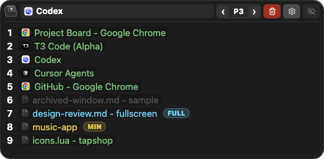

**Targeted Application Pairing System w/ Hotkey Oriented Playback**

> _Taps on your keyboard converted to efficient window hopping._

---

## What It Does

1. Window pairing slots (`1`-`9`) so one hotkey can jump back to a specific app window.
2. On macOS, twelve remappable profile banks that swap which nine slots are active in the popover and hotkeys.
3. Context-aware pair/focus/minimize flow:
   - First press pairs current window to slot.
   - Later press on same slot focuses paired window.
   - Double-tap while already focused to minimize (configurable).
4. Global media-style controls:
   - YouTube seek/play targeting browser tabs by window title.
   - Spotify transport/seek/volume controls.
---

## Windows — AutoHotkey v2

### Running with AHK Installation

1. Install [AutoHotkey v2.0](https://www.autohotkey.com/)
2. Run `TAPSHOP-windows/TAPSHOP.ahk`

### Running without AHK Installation

This repository ships source scripts. If you want a standalone `.exe`, compile `TAPSHOP-windows/TAPSHOP.ahk` with AutoHotkey v2's compiler (`Ahk2Exe`).

> [!TIP]
> - Place script ahk/exe (or shortcut) in `%APPDATA%\Microsoft\Windows\Start Menu\Programs\Startup` to autorun on startup.
> - Applications running at admin level will ignore script functions, which can be fixed by also running the script ahk/exe as admin.

> [!WARNING]
> - Setting the run as admin flag on with the script in the Startup folder (as shown below) will NOT autorun the script on startup. 
> - To allow this script to autorun at admin level on startup, use the native Windows Task Scheduler to bypass the UAC prompt requirement needed for script execution permission.


### Hotkey Bindings (Windows)
> **Windows:** Refer to AHK's [Hotkeys](https://www.autohotkey.com/docs/v2/Hotkeys.htm) & [List of Keys](https://www.autohotkey.com/docs/v2/KeyList.htm) documentation for modifiers & keycodes.

| Hotkey | Action |
|---|---|
| `Win + [1-9]` | Pair/focus/minimize slot `[1-9]` |
| `Ctrl + Win + [1-9]` | Unpair slot `[1-9]` |
| `Ctrl + Win + 0` | Unpair all slots |
| `Win + \`` | Show active window stats |
| `Ctrl + Win + \`` | Toggle TAPSHOP GUI |
| `F19` / `Ctrl + F19` | YouTube rewind `5s` / `10s` |
| `F20` | YouTube play/pause |
| `F21` / `Ctrl + F21` | YouTube forward `5s` / `10s` |
| `Media_Prev` / `Media_Play_Pause` / `Media_Next` | Spotify previous/play-pause/next |
| `Ctrl + Media_Prev` / `Ctrl + Media_Next` | Spotify seek backward/forward |
| `F22` | Spotify like/unlike |
| `F23` / `F24` | Spotify volume down/up |
| `Ctrl + F22` / `Ctrl + F23` / `Ctrl + F24` | System mute / volume down / volume up |


---

## macOS — Hammerspoon

### Setup

1. Install [Hammerspoon](https://www.hammerspoon.org/)
2. Clone TAPSHOP and choose the branch you want to run:

   ```sh
   mkdir -p ~/Documents/GitHub
   cd ~/Documents/GitHub
   git clone https://github.com/legacynical/tapshop.git
   cd tapshop
   git checkout main
   ```

   `main` contains the complete repo. macOS-only users can instead check out `macos` to avoid tracking Windows and legacy files.

3. Add a loader to `~/.hammerspoon/init.lua` that points at your cloned repo:

   ```lua
   local tapshopRoot = os.getenv("HOME") .. "/Documents/GitHub/tapshop/TAPSHOP-macos"

   tapshop = dofile(tapshopRoot .. "/TAPSHOP.lua")
   ```

   If you clone somewhere else, update `tapshopRoot` to that clone location. Keep the full `TAPSHOP-macos/` folder intact; `TAPSHOP.lua` loads sibling folders such as `hotkeys/`, `persistence/`, `services/`, `state/`, and `ui/`.

4. Grant Hammerspoon Accessibility access in `System Settings -> Privacy & Security -> Accessibility`.
5. Quit and reopen Hammerspoon after enabling Accessibility.
6. Reload Hammerspoon config (`Cmd + Shift + R` from the menu bar, or run `hs.reload()`).

### Branch Options

The public repo's default branch is `main`, which contains all supported platform and legacy source trees. Platform-specific release branches can be used when you only want one slice of the repo:

| Branch | Intended contents |
|---|---|
| `main` | Full repo: macOS, Windows, legacy variants, shared assets, and public docs |
| `macos` | macOS Hammerspoon implementation and assets only |
| `windows` | Windows AutoHotkey v2 implementation and assets only |
| `legacy` | Historical `GYTP-*` variants only |

Use the same setup flow and replace `git checkout main` with the branch you want, for example `git checkout macos`.

TAPSHOP stores its macOS files under `~/.hammerspoon/tapshop/`:

- `settings.json` for user-facing preferences and hotkey overrides
- `appdata.json` for internal persisted state such as pairings, window geometry, the active macOS profile, and each profile bank's saved slots

### Required Permissions (macOS)

1. Hammerspoon must have Accessibility access.
2. Hammerspoon must be quit and reopened after Accessibility is enabled.
3. If prompted during Spotify actions, allow Apple Events/Automation permissions for Hammerspoon.

### Hotkey Bindings (macOS)

> **macOS:** Refer to Hammerspoon's [hs.hotkey](https://www.hammerspoon.org/docs/hs.hotkey.html) documentation.

### macOS (`TAPSHOP-macos/TAPSHOP.lua`)

| Hotkey | Action |
|---|---|
| Unbound by default | Profile switching can be assigned to `F1`-`F12` or any other preferred shortcuts |
| `Cmd + Option + [1-9]` | Pair/focus/minimize slot `[1-9]` |
| `Cmd + Option + Shift + [1-9]` | Unpair slot `[1-9]` |
| `Cmd + Option + Shift + 0` | Unpair all slots |
| `Cmd + Option + \`` | Toggle popover UI |
| `Cmd + Option + Left/J` | YouTube rewind `5s` / `10s` |
| `Cmd + Option + Right/L` | YouTube forward `5s` / `10s` |
| `Cmd + Option + K` | YouTube play/pause |
| `F19/F20/F21` (+ Ctrl variants) | Optional YouTube bindings (if key exists) |
| `F7/F8/F9` or remapped equivalents | Optional Spotify transport bindings |
| `Ctrl + F7/F9` | Optional Spotify seek backward/forward |
| `F22/F23/F24` | Optional Spotify like + volume bindings |
| `Cmd + Option + Ctrl + ,/. / M` | System volume down/up/mute |

Hotkeys can be remapped from the popover settings:

1. Press `Cmd + Option + \`` to open the popover
2. Click the cog icon in the header
3. Use the `General` or `Hotkeys` tab

If you remap the popover shortcut away from `Cmd + Option + \``, TAPSHOP keeps a hidden recovery path: press the default shortcut three times quickly to show the popover.



---

## Behavior Notes

- YouTube targeting is title-based and browser-filtered. Expected title pattern includes ` - YouTube`; `Subscriptions - YouTube` is intentionally ignored.
- Slot minimize behavior is threshold-based (`minimizeThreshold`), not immediate on first repeat press.
- On macOS, slot pairings persist across Hammerspoon reloads/restarts for each profile bank. Closed paired windows can remain recoverable and relink automatically when a matching window returns, depending on settings.
- On Windows, Spotify transport is sent using `WM_APPCOMMAND`; on macOS it uses Hammerspoon Spotify APIs + AppleScript helpers.

---

## Troubleshooting

- YouTube commands do nothing:
  - Ensure a supported browser window title currently matches a YouTube watch page.
  - Open a video tab once to refresh target detection.
- Pairing hotkeys do nothing on Windows:
  - Check if target app is elevated (run TAPSHOP as admin too).
- macOS hotkeys not firing:
  - Confirm Hammerspoon Accessibility permission is enabled.
  - If you just enabled Accessibility, quit and reopen Hammerspoon before reloading the config.
  - Some optional F-key bindings are only registered if that key exists in `hs.keycodes.map`.
  - If you remapped the popover toggle and forgot it, press `Cmd + Option + \`` three times quickly to reopen the popover.
- macOS setup errors with `module ... not found`:
  - Confirm `tapshopRoot` in `~/.hammerspoon/init.lua` points to the cloned repo's `TAPSHOP-macos` folder.
  - Confirm the full `TAPSHOP-macos/` folder is still intact; do not copy only `TAPSHOP.lua`.
- Spotify actions fail on macOS:
  - Open Spotify at least once and allow Automation prompts for Hammerspoon.

---

## Repository Layout

| Path | Purpose |
|---|---|
| `TAPSHOP-windows/TAPSHOP.ahk` | Main Windows implementation (AHK v2) |
| `TAPSHOP-macos/TAPSHOP.lua` | Main macOS implementation (Hammerspoon) |
| `GYTP-AHKv2-media-keys` | Legacy media-key-focused script |
| `GYTP-AHKv2-keyboard-75` | Legacy 75% keyboard variant |
| `GYTP-AHKv1.1-deprecated` | Legacy AHK v1.1 script |

---

## Legacy Versions

The original single-purpose scripts are preserved in their respective folders:

| Folder | Description |
|---|---|
| `GYTP-AHKv2-media-keys` | AHK v2 — media key hotkeys (original) |
| `GYTP-AHKv2-keyboard-75` | AHK v2 — QMK 75% keyboard variant ([details](./GYTP-AHKv2-keyboard-75/README.md)) |
| `GYTP-AHKv1.1-deprecated` | AHK v1.1 — deprecated |

---

## License

This project's scripts are provided under the MIT license.

**Windows (AHK):** The AutoHotkey interpreter is under the [GPL-2.0 license](https://github.com/AutoHotkey/AutoHotkey?tab=GPL-2.0-1-ov-file). This applies to compiled builds (`.exe`) because they bundle the AHK script and interpreter. For most users or developers this is not a practical concern, as GPL-2.0 is permissive.

**macOS (Hammerspoon/Lua):** The macOS stack relies on [Hammerspoon](https://www.hammerspoon.org/) (MIT) and [Lua](https://www.lua.org/) (MIT). If you distribute software that includes or depends on them, you must retain their copyright notices and the full MIT license text for each. Hammerspoon’s license is in its [repository](https://github.com/Hammerspoon/hammerspoon); Lua’s license is at [lua.org/license.html](https://www.lua.org/license.html).
